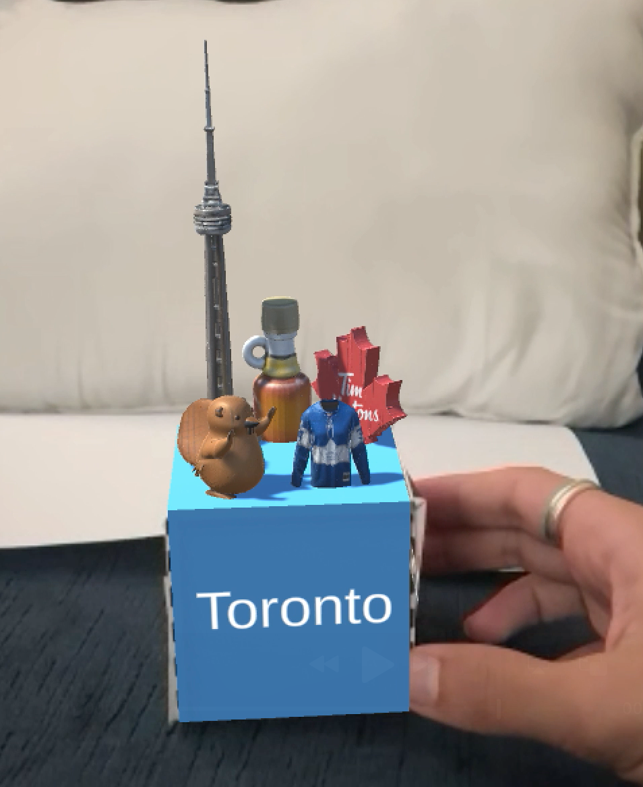

# AR Knick-Knack: NYC x Toronto

Developer: Fareena

## Project Summary
I built this project as a Unity + Vuforia augmented reality experience around two physical tracked cubes: one for New York City and one for Toronto. When my webcam detected each cube, a miniature city scene appeared on top of it with live city information (time, weather, and flights in the sky). When both cubes were visible at once, I triggered a plane animation between the two cities.

## Motivation and Chosen Locations
I chose New York City and Toronto because both cities were personally meaningful to me and had strong visual identities that translated well into miniature AR scenes. I also initially thought they were popular enough for me to easily find assets.

These two cities also worked well together conceptually because travel between them is common. I used that relationship as the core interaction in the project: the animated plane appeared only when both city cubes were tracked at the same time.

## Design
### Knick-knack models
I built each cube as a custom miniature scene using a mix of generated and hand-made 3D assets.

New York models:
- Generated with Meshy AI: Empire State Building, Statue of Liberty, Brooklyn Bridge
- Modeled myself in Blender: taxi, bagel

Toronto models:
- Generated with Meshy AI: CN Tower, Tim Hortons logo as a maple-leaf, beaver (national animal), hockey-themed objects.

I tested a few free basic assets first, but I switched to Meshy AI models because they looked much better and were easier to manage. Using Meshy exports directly also helped me avoid importing large asset packages that would bloat my repo.

### Visual elements in the experience
- I displayed live data text on cube faces: city name, current temperature, local time, and nearby flights in the sky
- I enabled plane animation between cities only when both Vuforia targets were tracked
- I shifted directional lighting by time of day: day, sunset, and night
- I mapped cube shell color to weather states: clear, rain, and snow
- I added ambient city audio to create a more city like atmosphere like car honks, people talking, and subway movement sounds to make the scenes feel more alive.

### Screenshots
I stored screenshots in the `Media/` folder.

Figure 1 showed my New York cube with landmark models and the live text panels, so readers could see how I combined visual identity and real-time city data in one AR object.

Figure 2 showed my Toronto cube and its Canadian themed props, highlighting how I used model selection to make the location recognizable at a glance.

Figure 3 showed the plane animation that appeared only when both cubes were tracked, which was the main interaction linking the two cities.

Figure 4 showed the lighting shift across different times of day. I also added an Inspector test option (which you can see on the bottom right) so I could manually switch time states (day, sunset, night) without waiting in real time, which helped me confirm the feature was working correctly.

Figure 5 showed weather-based color changes on the cube shell. I added a matching Inspector test setting (which you can see on the bottom right) so I could manually test clear, rain, and snow states and verify the visual mapping worked correctly.

## Process
### How the application is structured
I organized core scripts under `Assets/Scripts/`:
In simple terms, these scripts pulled live city data, updated the cube visuals/text, and controlled movement/lighting behaviors in the AR scene.
- `NYCWeatherAPI.cs`, `TORWeatherAPI.cs`: fetched temperature from Open-Meteo
- `NYCTimeAPI.cs`, `TORTimeAPI.cs`: fetched and formatted local city time from Open-Meteo
- `NYCNumFlightsAPI.cs`, `TORNumFlight.cs`: fetched flight state data from OpenSky Network and counted nearby flights
- `PlanePresenceManager.cs`: checked Vuforia target visibility and controlled plane orbit behavior
- `TaxiMove.cs`: animated a taxi model around a local perimeter path
- `CityTimeController.cs`: applied day/sunset/night lighting profile
- `CityWeatherController.cs`: applied weather-based cube shell colors

### How the scripts work together
- When the scene starts and the cubes were tracked, the city scripts will began updating their text panels.
- The weather/time/flight scripts will call APIs on a refresh loop, then wrote the newest values to TextMeshPro text objects.
- If an API call failed, I kept the last good value (or showed `N/A`) so the UI did not break.
- `PlanePresenceManager` checks whether both targets were visible: if yes, it enabled and updated the plane orbit animation.
- `CityTimeController` and `CityWeatherController` applied environment changes so the scene reflected conditions visually, not just through text:
  - Daytime: I used brighter white light.
  - Sunset: I shifted to warmer orange light with lower intensity.
  - Nighttime: I used dimmer cool/blue lighting.
  - Clear weather: I set the cube shell to a sky-blue tone.
  - Rain: I set the cube shell to a darker blue.
  - Snow: I set the cube shell to white.

### Tools, libraries, and APIs
- Unity (project created with `6000.3.6f1`)
- Vuforia Engine (image/multi-target tracking)
- TextMeshPro (in-scene text labels)
- Blender (custom model creation)
- Meshy AI (generated city props)
- Open-Meteo API (`api.open-meteo.com`) for weather and local time
- OpenSky Network API (`opensky-network.org`) for flights-in-sky counts
- iPhone Continuity Camera with macOS for higher-quality camera input during AR testing (my Mac webcam was limited to 720p)

### How I ran the project
1. I installed Unity Hub and Unity Editor `6000.3.6f1`.
2. I cloned the repository:
   - `git clone https://github.com/khanfarr/ar-project-1.6.git`
3. I opened my project folder in Unity Hub.
4. I opened scene: `Assets/Scenes/SampleScene.unity`.
5. I added the appropriate targets in the [Vuforia Engine](https://developer.vuforia.com/develop/) database.
6. I confirmed Vuforia was enabled and my webcam was selected.
7. I entered Play mode and presented the tracked cube to the camera.

### Code and live links
- Source code: https://github.com/khanfarr/ar-project-1.6
- Live build: Not deployed

## Challenges and Future Work
### Challenges
- I struggled to find city specific assets so I generated several models and then iterated on placement and scaling in Unity.
- I had to tune hierarchy and transforms carefully to keep both cubes stable when they were tracked at the same time.
- I had to handle API failures and incomplete responses, so I used fallback displays (`N/A` or the last successful value) to keep text readable.
- I made a subway entrance model in Blender that I thought looked really cool, but it broke when I transferred it into Unity. I tried a few fixes, but I was spending too much time on it, so I decided to make a bagel model instead.
- Git corrupted my project several times during development, and I had to restart 4 times. This was definitely the most frustrating part of the project, but I do think it helped me nail how to get a project up and running quickly.
- I also had to use a non-standard Git setup near the end, and I was not fully sure whether it affected the project, so I recorded my demo video first as a backup.
- I found text and object placement in Unity tedious because I had to keep entering Play mode to check positioning changes.

### Future work
- I wanted to add more interactivity so people could click/tap things and trigger mini actions in each city scene.
- I wanted to upgrade the weather visuals with actual rain/snow effects instead of only changing the cube color.
- I wanted to polish the models and overall layout so the scenes felt more detailed and intentional.
- I wanted to add more city cubes and let users pick travel routes between them.
- I wanted to publish a proper standalone build so people could test it more easily.
- I wanted to reduce the slight lag by optimizing models, textures, and how often data/UI updates ran.
- I wanted a faster way to adjust text and object placement in-editor without entering Play mode every time.

## Use of AI and Collaboration

- I used Meshy AI to generate hard-to-find location-specific 3D models.
- I used generative AI assistants for debugging support, initial ideation, and script guidance.
- I reviewed and adjusted all AI outputs manually in Unity and C#.
- I also discussed debugging issues and AR setup decisions with classmates during development.

## Demo Video
- [Watch demo video](https://youtu.be/j1VwndaSRAA)
