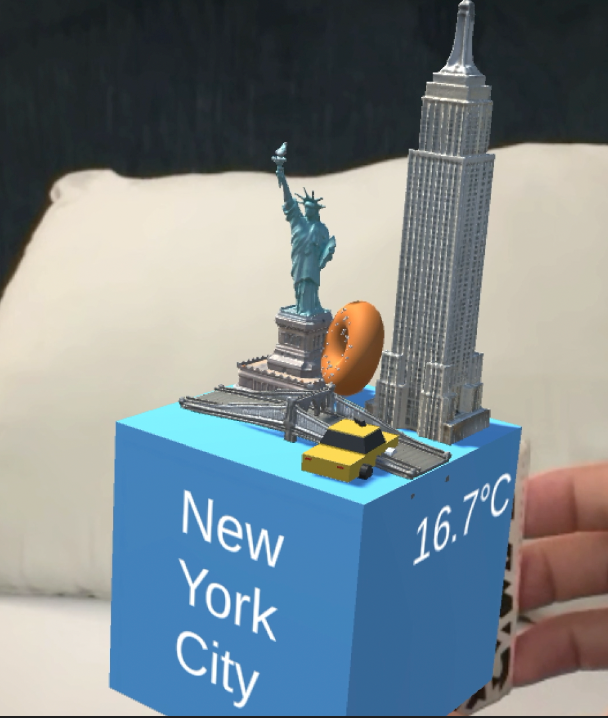
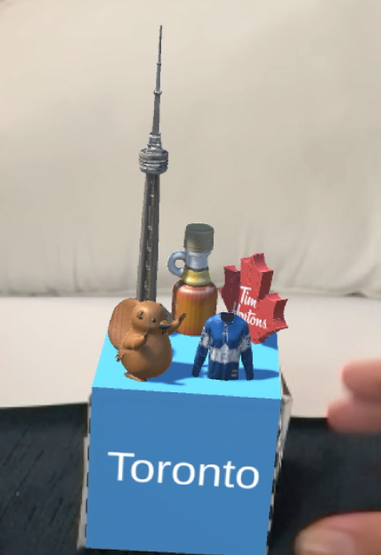
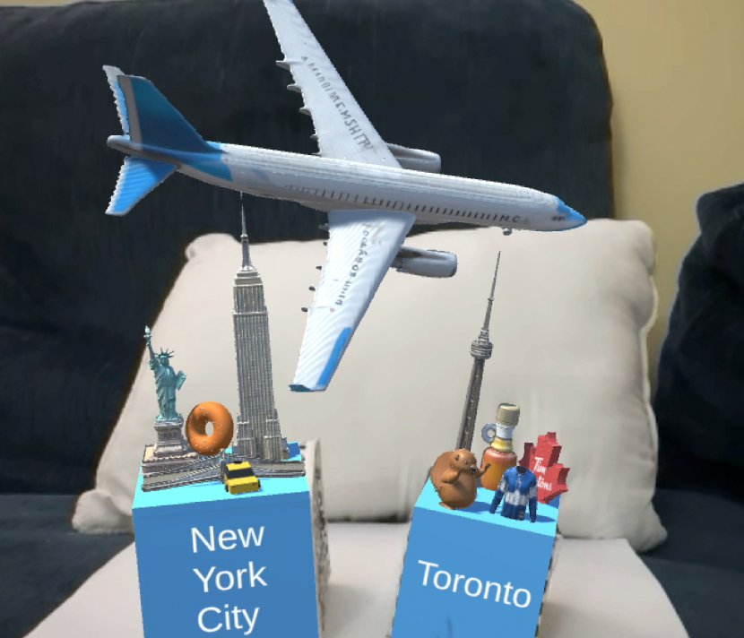
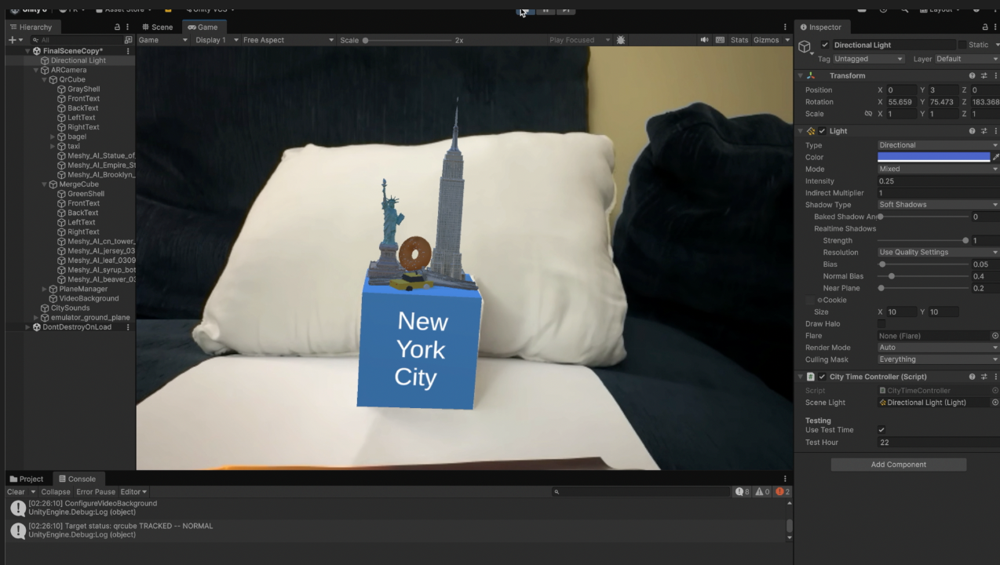
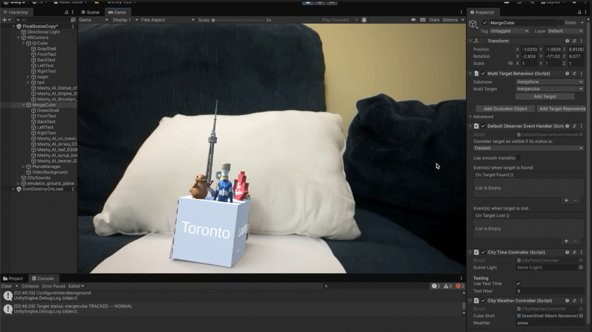

# AR Knick-Knack: NYC x Toronto

Developer: Fareena

## Project Summary
I built this project as a Unity + Vuforia augmented reality experience around two physical tracked cubes: one for New York City and one for Toronto. When my webcam detects each cube, a miniature city scene appears on top of it with live city information (time, weather, and flights in the sky). When both cubes are visible at once, I trigger a plane animation between the two cities.

## Motivation and Chosen Locations
I chose New York City and Toronto because both cities are personally meaningful to me and have strong visual identities that translate well into miniature AR scenes. I also intially thought they were popular enough for me to easily find assets.

These two cities also work well together conceptually because travel between them is common. I used that relationship as the core interaction in the project: the animated plane appears only when both city cubes are tracked at the same time.

## Design
### Knick-knack models
I built each cube as a custom miniature scene using a mix of generated and hand-made 3D assets.

New York models:
- Generated with Meshy AI: Empire State Building, Statue of Liberty, Brooklyn Bridge
- Modeled myself in Blender: taxi, bagel

Toronto models:
- Generated with Meshy AI: CN Tower, Time Hortons logo as a maple-leaf, beaver (national animal), hockey-themed objects.

I tested a few free basic assets first, but I switched to Meshy AI models because they looked much better and were easier to manage. Using Meshy exports directly also helped me avoid importing large asset packages that would bloat my repo.

### Visual elements in the experience
- I display live data text on cube faces: city name, current temperature, local time, and nearby flights in the sky
- I enable plane animation between cities only when both Vuforia targets are tracked
- I shift directional lighting by time of day: day, sunset, and night
- I map cube shell color to weather states: clear, rain, and snow
- I add ambient city audio to give both knick-knacks more atmosphere

### Screenshots (link these to the text above)
I store screenshots in the `Media/` folder.

Figure 1 relates to: NYC model choices (Empire State, Statue of Liberty, bridge, taxi, bagel) and face text.

Figure 2 relates to: Toronto model choices (CN Tower, beaver, maple/hockey props) and face text.

Figure 3 relates to: inter-cube interaction and travel metaphor.

Figure 4 relates to: visual systems (time-based lighting).

Figure 5 relates to: visual systems (weather-based color changes).

## Process
### How the application is structured
I organized core scripts under `Assets/Scripts/`:
- `NYCWeatherAPI.cs`, `TORWeatherAPI.cs`: fetch temperature from Open-Meteo
- `NYCTimeAPI.cs`, `TORTimeAPI.cs`: fetch and format local city time from Open-Meteo
- `NYCNumFlightsAPI.cs`, `TORNumFlight.cs`: fetch flight state data from OpenSky Network and count nearby flights
- `PlanePresenceManager.cs`: checks Vuforia target visibility and controls plane orbit behavior
- `TaxiMove.cs`: animates a taxi model around a local perimeter path
- `CityTimeController.cs`: applies day/sunset/night lighting profile
- `CityWeatherController.cs`: applies weather-based cube shell colors

### Tools, libraries, and APIs
- Unity (project created with `6000.3.6f1`)
- Vuforia Engine (image/multi-target tracking)
- TextMeshPro (in-scene text labels)
- Blender (custom model creation)
- Meshy AI (generated city props)
- Open-Meteo API (`api.open-meteo.com`) for weather and local time
- OpenSky Network API (`opensky-network.org`) for flights-in-sky counts
- iPhone Continuity Camera with macOS for higher-quality camera input during AR testing (my Mac webcam is limited to 720p)

### How to run the project
1. Install Unity Hub and Unity Editor `6000.3.6f1`.
2. Clone the repository:
   - `git clone https://github.com/khanfarr/ar-project-1.6.git`
3. Open my project folder in Unity Hub.
4. Open scene: `Assets/Scenes/SampleScene.unity`.
5. Add the target database in [Vuforia Engine](https://developer.vuforia.com/develop/).
6. Confirm Vuforia is enabled and your webcam is selected.
7. Enter Play mode and present the tracked cube to the camera.

### Code and live links
- Source code: https://github.com/khanfarr/ar-project-1.6
- Live build: Not deployed

## Challenges and Future Work
### Challenges
- Asset sourcing: it was difficult to find Toronto-specific props with a consistent visual style, so I generated several models and then iterated on placement/scaling in Unity.
- Tracking stability: showing both cubes at once while keeping scene alignment stable required hierarchy and transform tuning.
- Real-time data robustness: API requests can fail or return incomplete data, so scripts use fallback displays (`N/A` or last successful value) to keep the UI readable.
- Git corrupted my project several times during development, so I had to restart 4 times. This was the most frustrating part of the project.
- I also had to do a non-standard Git setup near the end and was not fully sure whether it affected the project, so I made sure to record my demo video first as a backup.
- Workflow friction in Unity: adjusting text and object placement was tedious because I had to enter Play mode repeatedly to check results.

### Future work
- Add direct interactivity (click/tap events and city-specific mini interactions)
- Replace basic weather-color mapping with full weather VFX (rain/snow particle systems)
- Improve model polish and scene composition for stronger visual storytelling
- Add more city cubes and a route-selection interaction between locations
- Publish a standalone build and add analytics/performance profiling
- Reduce runtime lag by optimizing models, textures, and update frequency of API/UI refreshes (tracking was stable, but the scene could still feel slightly laggy at times)
- Improve iteration speed by building a better in-editor placement workflow for text and props, so layout changes can be tested faster without constant Play-mode switching

## Use of AI and Collaboration

- I used Meshy AI to generate hard-to-find location-specific 3D models.
- I used generative AI assistants for debugging support, initial ideation, and script guidance.
- I reviewed and adjusted all AI outputs manually in Unity and C#.
- I also discussed debugging issues and AR setup decisions with classmates during development.

## Demo Video
- [Watch demo video](Media/ar-project-1-demo.mp4)
